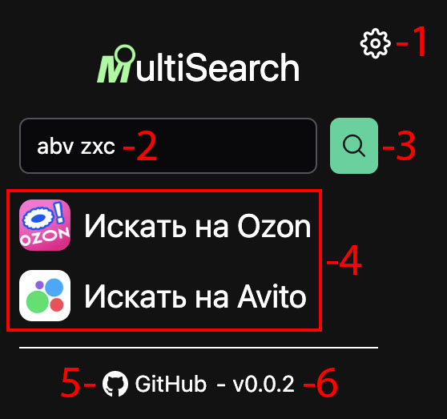
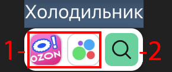
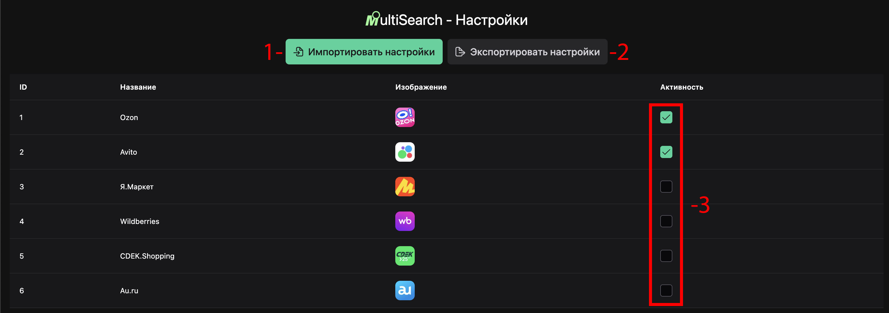
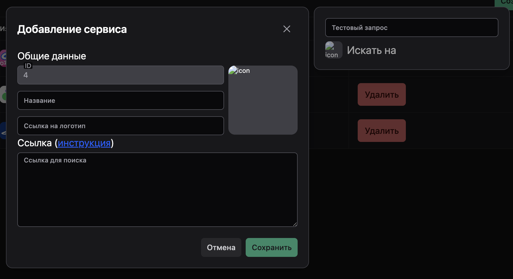
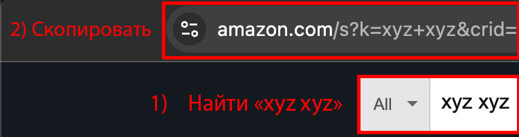

# 🛒 Market Multi Search

**Market Multi Search** — это расширение для браузера, которое позволяет искать товары на маркетплейсах и досках объявлений (пока что не на всех) в один клик.

- [🚀 Установка](#-установка)
- [⚠️ Важная информация](#-важная-информация)
- [⚡ Использование](#-использование)
- [⚙️ Настройки](#-настройки)
- [🔋 Добавление сервисов](#-добавление-сервисов)
---

## 🚀 Установка

1. Скачайте **zip-архив** последней версии расширения из вкладки с [релизами](https://github.com/maxletsplay1/Market-Multi-Search/releases).
2. Распакуйте его в любое удобное место на компьютере.
3. Откройте браузер **Google Chrome** или **Яндекс**.
4. Введите в поисковой строке ```chrome://extensions/``` или ```browser://extensions/``` или перейдите в меню:
   Настройки → Дополнительные инструменты → Расширения
5. Включите режим **Разработчика** (Developer mode) в правом верхнем углу.
6. Нажмите кнопку **Загрузить распакованное** (Load unpacked).
7. Укажите папку с распакованным расширением.

### ✅ Готово!

После этого расширение появится в списке установленных, и вы сможете закрепить его на панели браузера для быстрого доступа.

---

## ⚠️ Важная информация

- **Не удаляйте папку с расширением и не переносите её**, иначе оно перестанет функционировать.
- Обновления нужно будет устанавливать **вручную**, скачивая новую версию расширения.
- **Расширение пока нестабильно** и может вызывать или иметь графические баги. Если вы заметили проблемы в отображении - сообщите о баге в репозитории.

---

## ⚡ Использование

### - Основной PopUp



1. ⚙️ **Переход на страницу настроек расширения**
2. 🔍 **Строка с запросом** - именно это будет искаться в 3 и 4 пунктах
3. 🌐 **Поиск по всем активным сервисам** - при нажатии будет произведен поиск по всем активным сервисам
4. ✅ **Активные сервисы** - при нажатии на любой из них будет произведен единичный поиск
5. 🐙 **Ссылка на GitHub репозиторий**
6. 📦 **Версия расширения**


### - Попап при выделении

После выделения текста на странице появляется такое окошко под или над выделенным текстом



1. ✅ **Активные сервисы** - при нажатии на любой из них будет произведен единичный поиск по выделенному тексту
2. 🌐 **Поиск по всем активным сервисам** - при нажатии будет произведен поиск по всем активным сервисам

---

## ⚙️ Настройки

### 🖥️ Интерфейс



1. 📂 **Загрузка настроек из файла**
2. 💾 **Сохранение настроек в файл**
3. ➕ **Добавление сервиса**
4. 🔄 **Изменение активности сервиса**
5. 🗑️ **Удаление сервиса**

### 💾 Структура JSON'а

```
[
  {
    "id": 1,                                      // id (пока что добавляется вручную)
    "name": "Au.ru",                              // название сервиса
    "iconUrl": "https://rustore.ru/image.jpeg",   // ссылка на иконку сервиса
    "searchUrl": "https://au.ru/?search=${text}", // поисковая ссылка, где ${text} - ваш запрос
    "separator": "%20",                           // разделитель(то, что идет вместо пробелов в звпросе)
    "active": true                                // активность сервиса
  }
]
```
---

## 🔋 Добавление сервисов

### 🖥️ Интерфейс



1. ✏️ Введите название сервиса
2. 🖼️ Вставьте ссылку на изображение(изобрадение, желательно, квадратное)
3. 🔍 Перейдите на желаемый сервис и осуществите на нем поиск по запросу ```xyz xyz```
4. 📎 Скопируйте ссылку из поисковой строки и вставьте в поле **"Ссылка для поиска"** 
5. 📐 Проверьте функционал в модальном окне справа
